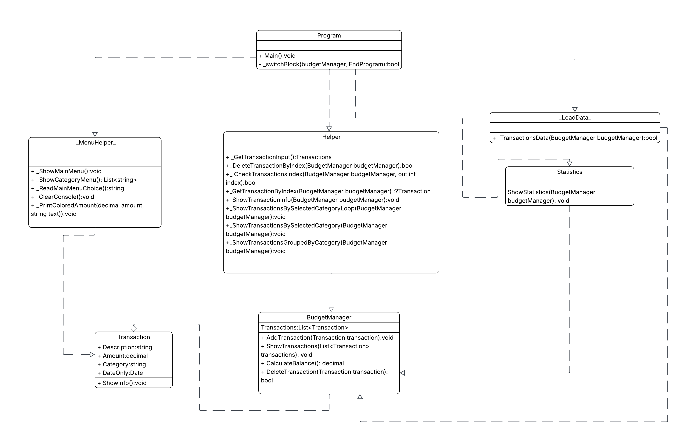
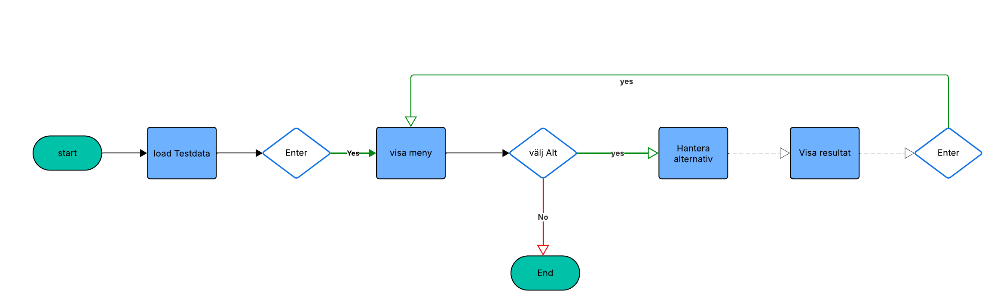

# 💰 Personal Budget Tracker

Ett C#-konsolprogram för att hantera personliga inkomster och utgifter. Programmet låter användaren registrera, visa, filtrera och analysera sina transaktioner på ett enkelt och strukturerat sätt.

---

## 🧩 Funktioner

- Lägg till nya transaktioner (inkomst eller utgift)
- Visa alla transaktioner
- Visa total balans (inkomster – utgifter)
- Ta bort transaktioner via index
- Visa detaljerad information om en specifik transaktion
- Filtrera transaktioner per kategori
- Visa alla transaktioner sorterade och grupperade efter kategori och datum
- Visa statistik: antal transaktioner, total inkomst, total utgift

---

## 🛠 Teknisk struktur

Projektet är uppdelat i flera klasser för tydlighet och ansvarsfördelning:

| Fil / Klass         | Ansvar |
|---------------------|--------|
| `Program.cs`        | Huvudloop, menyhantering och programflöde |
| `Transaction.cs`    | Representerar en enskild transaktion |
| `BudgetManager.cs`  | Hanterar listan av transaktioner och logik |
| `Helper.cs`         | Innehåller metoder för användarinteraktion (t.ex. inmatning, borttagning) |
| `MenuHelper.cs`     | Visar menyer, rensar konsolen, visar hjälp |
| `Statistic.cs`      | Visar statistik över transaktioner |
| `LoadData.cs`       | (Valfritt) Laddar in testdata eller tidigare sparad data |

---

## 🧱 Klassstruktur

Diagrammet nedan visar klassernas ansvar och relationer i programmet.




Relationer mellan klasserna visualiseras med beroendepilar (streckade med öppen spets) och aggregationssymboler (tom romb).

---

## 🔁 Flödesschema

Flödesschemat visar hur användaren interagerar med programmet via menyval.



---

## 🚀 Kom igång

1. Klona projektet från GitHub:
   ```bash
   git clone https://github.com/qubicbit/PersonalBudgetTracker.git
2. Öppna projektet i Visual Studio eller Visual Studio Code.

Kör programmet: dotnet run

🧪 Exempel på menyval
Budgetmeny:
1. Lägg till transaktion
2. Visa alla transaktioner
3. Visa total balans
4. Ta bort transaktion
5. Visa info för en specifik transaktion
6. Visa transaktioner per kategori
7. Visa alla transaktioner sorterade efter kategori
8. Visa statistik
0. Avsluta programmet


💡 Tips
Transaktioner färgkodas: grön för inkomster, röd för utgifter.

Du kan filtrera transaktioner per kategori och se totalsummor.

Statistik visar både antal, total inkomst, total utgift och nettosumma.

📦 GitHub-hantering
Använd git add, git commit, git push för att spara och ladda upp ändringar.


## 🔹 Namn och datum
**Namn:** Ehsan Sistani  
**Datum:** Oktober 2025